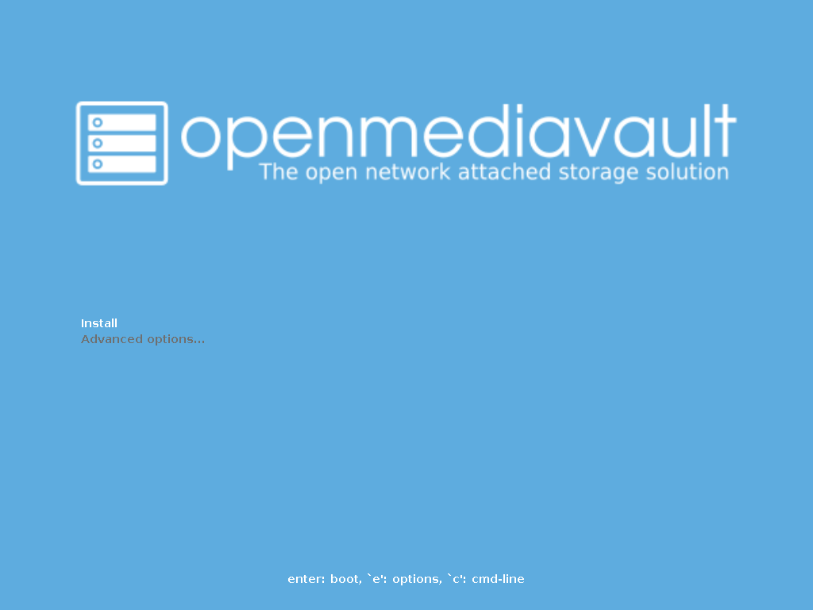
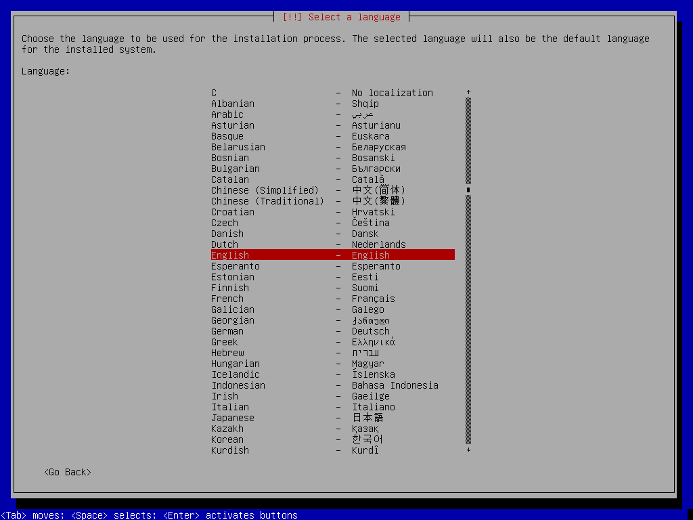
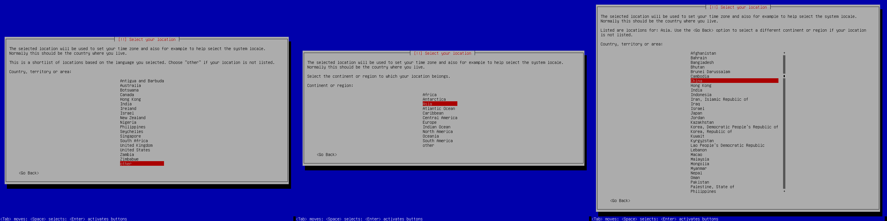
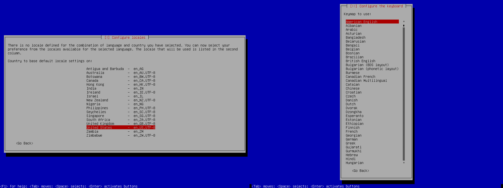
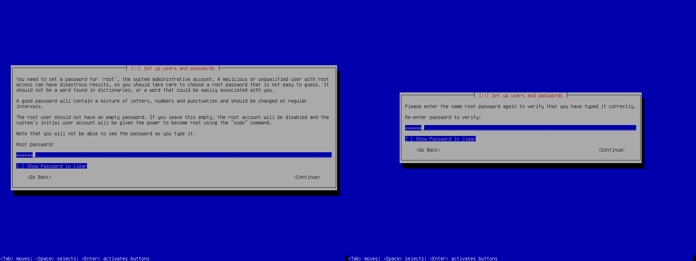

前面写了几篇 OMV 的文章，看网上这类中文教程很少，我决定写一系列的 OMV 介绍文章。

我自己都不是踩坑了，直接从水里趟过来的，希望大家看了我的文章，能少踩一些坑。

<!-- more -->

> 本文所用 OMV 版本为 OMV5，安装镜像为 `openmediavault_5.3.9-amd64.iso` 。

## 视频教程

<Bilibili bvid="BV1Lv411173Q" :page=1 :danmaku="true" />

## 简介与镜像下载

OMV 全称是 OpenMediavault，是基于 Debian 的一个开源 NAS 系统，具体资料可以去百度，我个人认为这是一个非常优秀和易用的 NAS 系统。

我喜欢用 OMV 的原因，主要是因为它基于 Debian 开发，遇到什么幺蛾子都不用怕，Debian 算是 Linux 家族中最易用的系统了，而且网上资料众多，解决问题相对容易。如果用 FreeNAS，基于 FreeBSD 的系统，出问题了想修都修不好。

只想将 OMV 当普通 NAS 用，没啥基础，找人帮你安装好系统，然后剩下的都在网页上操作就可以了，但是想要用好 OMV，基础的 Linux 知识是要有的，Debian 能在命令行模式下进行基本的操作。

OMV 的镜像可以可以在[官网](https://www.openmediavault.org/)下载，就不过多赘述了。

下载之后用 [etcher](https://www.balena.io/etcher/) 将镜像烧录到 U 盘里，做成启动盘。

## 安装

> 安装部分使用虚拟机演示，实机操作与虚拟机完全一致。

> 注意，演示所用环境，启动方式为 UEFI，非 secure boot，硬盘协议为 SATA，需要空间，10G 以上，推荐 60G 或更大空间。安装之前推荐将机器连接网络。

> 常用按键：左上右下、Tab、Enter、Speace。

首先开机，进入安装界面，选项 Install 开始安装。

安装语言选择英文即可，不要选中文，中文会乱码。

然后是区域设置，这里我们选择中国。

再接下来是本地化和键盘设置，全都选择美国即可。

然后是设置密码，输入两次 root 密码。

再接下来是网络设置，下面两张图填写的是主机名，这里根据你自己的实际情况填写，不懂的话默认即可，不需要修改。如果你的机器没有联网，会让你手动设置，这个时候跳过即可。

再接下来是选择安装硬盘，如果只有一块硬盘，就不会出现这个界面。

等完成基本系统安装之后，就是选择镜像源了，这一步选择你认为最快的镜像源。

等完成基本软件更新之后，再接下来就会自动重启，不出意外的话，重启之后就可以正常进入系统了。

安装教程到此结束。

## 结语

这篇文章简单讲解了怎么安装 OMV，但是安装仅仅只是迈出的第一步，看完这篇文章别着急做，希望多看几篇，有一定的知识储备之后再开始动手。

## 参考

[https://openmediavault.readthedocs.io/en/5.x/installation/via_iso.html](https://openmediavault.readthedocs.io/en/5.x/installation/via_iso.html)

---
