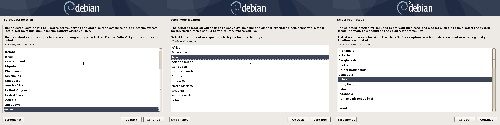
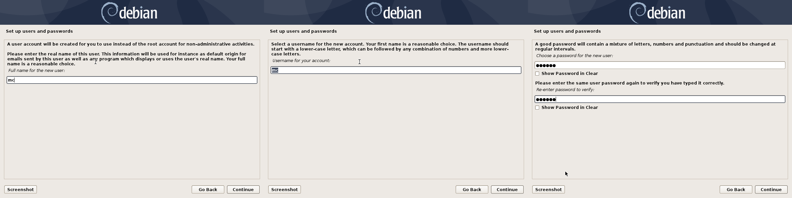
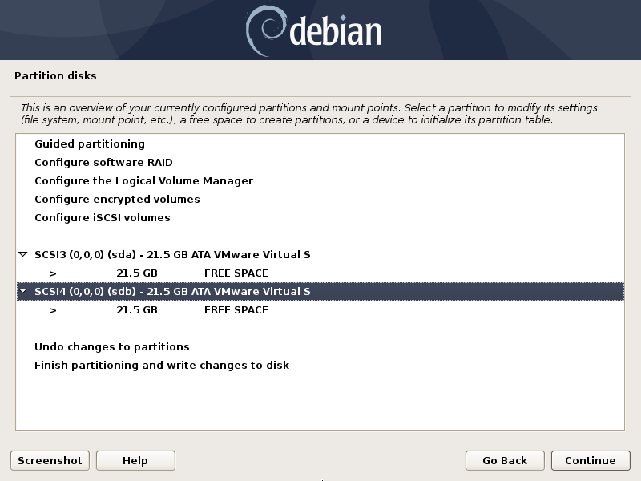
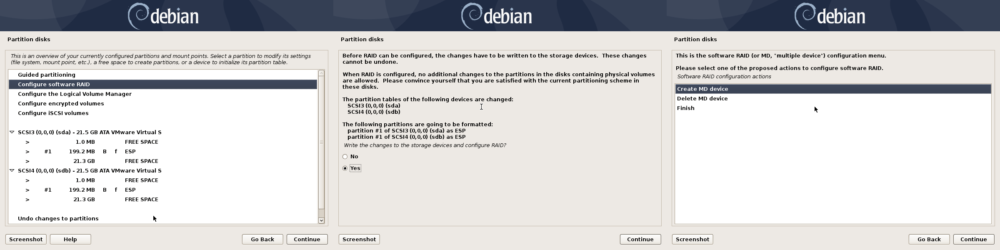
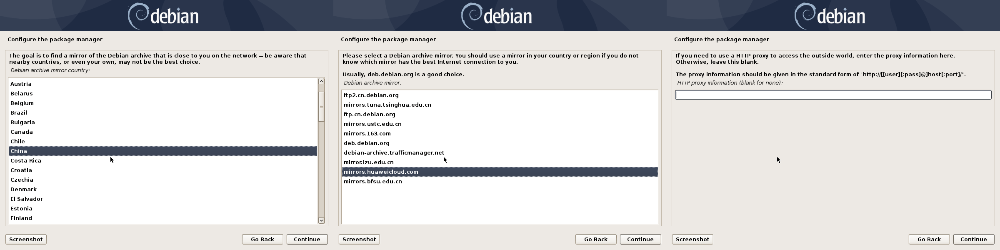
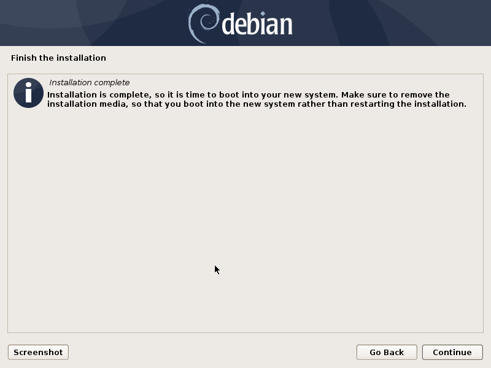
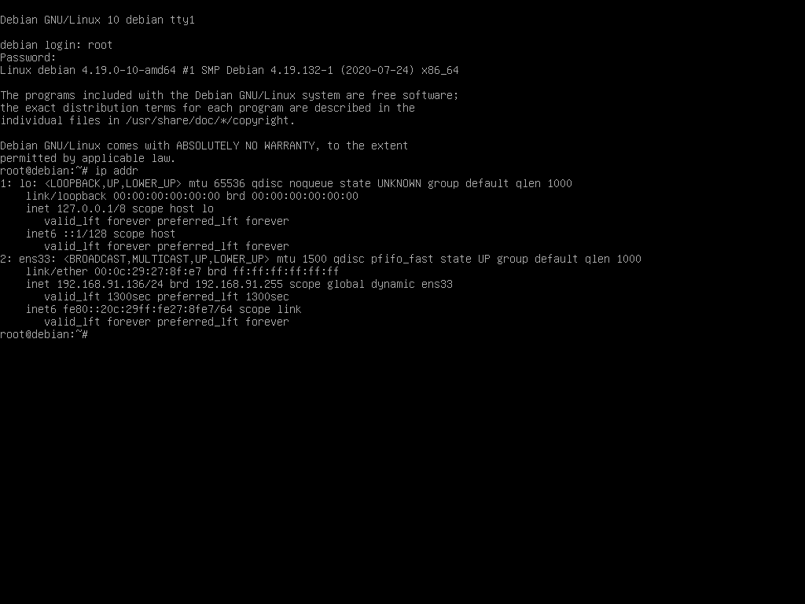
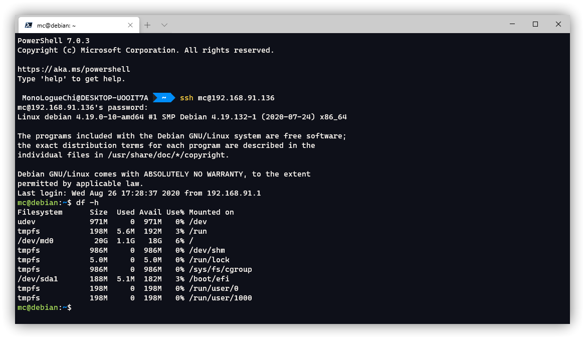

这一篇文章讲怎么让 OMV 系统拥有冗余功能。也就是在 raid 上安装 OMV 系统，坏掉任意一块硬盘的情况下，系统照样能启动。

<!-- more -->

## 准备

> 本文所用镜像为 `debian-10.5.0-amd64-netinst.iso`

> 注意，演示所用环境，启动方式为 UEFI，非 secure boot，硬盘协议为 SATA，需要空间，10G 以上，推荐 60G 或更大空间。安装之前推荐将机器连接网络。

> 最好有 Linux 安装经验，看到英文不要慌，遇到和文章里不一样的，或者是看不懂的，尝试去翻译一下。每张图具体是什么意思，翻译一下图上的英文就能看懂，这个真的不难，我这个四级没过的废物都能看得懂。

这一次我们需要从 Debian 安装 OMV，所以需要一个 Debian10 的镜像，可以在[这里](https://mirrors.huaweicloud.com/debian-cd/)下载。

本文目的是讲 Debian 安装在 raid1 上，并在每个硬盘上安装引导，做的在任意一块硬盘损坏的情况下，系统均能正常启动。

## 视频教程

<Bilibili bvid="BV1Hh411R7iD" :page=1 :danmaku="true" />

## 安装 Debian

请确保系统插入了两块以上的硬盘用于安装系统盘，接下来跟我我的讲解进入安装步骤。

首先进入图形化安装界面，语言选择英文即可。


区域选择中国，键盘选择美式键盘。




再接下来是网络设置，下面两张图填写的是主机名，这里根据你自己的实际情况填写，不懂的话默认即可，不需要修改。如果你的机器没有联网，会让你手动设置，这个时候跳过即可。


接下来输入 root 密码。


再接下来创建一个新用户。



然后是硬盘部分，这是这篇文章的重点之一，这里选择手动分区。

先创建好分区表，选择对应的硬盘，直接回车即可创建。注意这会清空硬盘里原有的分区，并且会清空数据。



然后创建一个 EFI 分区，不用太大，够用就行，你如果嫌小，可以自己改大一点。


对另一块硬盘做相同的操作，两块硬盘最好是完全一致。


然后开始创建软 raid，过程可以看图，看不懂的简单翻译一下就明白了。



两块硬盘都选上，空闲 0 块。


选择未分区的两个位置，创建软 raid。


然后为创建出来的软 raid 分区，这里演示只有一个分区，没有必要按照网上教程分那么多区，然后分目录去挂载，一个就可以。


然后确定不要 swap 分区，并且确定分区的更改。


确定不插入其他 CD。


选择合适的镜像源，这里选你认为最快的。



选择需要安装的服务。


最后等安装完成，重启应该就可以进入系统。



## 创建另一个启动项

这样虽然把系统安装在了 raid1 上，但是引导只安装在了一块硬盘上，如果引导所在的硬盘挂了，那系统照样是会挂的。

接下来需要安装另一个启动引导。

登录系统，输入

```
ip addr
```

查看当前 ip。



然后远程登录上去。

```
ssh mc@192.168.91.136
```

然后切换到 root 用户，安装一些必要的软件

```bash
su

apt update
apt install sudo vim net-tools efibootmgr
```

将 mc 添加进 sudo 用户组

```bash
/sbin/usermod -a -G sudo mc
```

然后关掉 ssh 连接，重新登录一遍。

输入

```bash
df -h
```



可以看到 `/dev/sda1` 是当前的 efi 磁盘，需要克隆到 `/dev/sdb1` 上（这个需要自行判断实际情况）。

```bash
sudo dd if=/dev/sda1 of=/dev/sdb1
```

然后创建新的引导项（下面的命令需要你根据实际情况自行修改）。

```bash
sudo efibootmgr -c -g -d /dev/sdb -p 1 -L "debian #2" -l '\EFI\debian\shimx64.efi'
```

## 测试

然后重启看一下是不是有了一个启动项 `debian #2`，尝试一下用这个启动项启动系统，然后再尝试分别拔掉两块硬盘，系统能否正常启动。

## 安装 OMV

> 建议：安装 OMV 之前将 `security.debian.org` 也替换掉
>
> ```bash
> sed -i "s@http://security.debian.org@https://mirrors.huaweicloud.com@g" /etc/apt/sources.list
> ```

首先将系统更新到最新

```bash
sudo apt-get update
sudo apt-get dist-upgrade
```

添加密钥

```bash
sudo apt-get install --yes gnupg
sudo wget -O "/etc/apt/trusted.gpg.d/openmediavault-archive-keyring.asc" https://packages.openmediavault.org/public/archive.key
sudo apt-key add "/etc/apt/trusted.gpg.d/openmediavault-archive-keyring.asc"
```

添加软件源

```bash
sudo vim /etc/apt/sources.list.d/openmediavault.list
```

写入内容为：

```
deb https://packages.openmediavault.org/public usul main
# deb https://downloads.sourceforge.net/project/openmediavault/packages usul main
## Uncomment the following line to add software from the proposed repository.
deb https://packages.openmediavault.org/public usul-proposed main
# deb https://downloads.sourceforge.net/project/openmediavault/packages usul-proposed main
## This software is not part of OpenMediaVault, but is offered by third-party
## developers as a service to OpenMediaVault users.
# deb https://packages.openmediavault.org/public usul partner
# deb https://downloads.sourceforge.net/project/openmediavault/packages usul partner
```

然后安装

```bash
export LANG=C.UTF-8
export DEBIAN_FRONTEND=noninteractive
export APT_LISTCHANGES_FRONTEND=none

sudo apt-get update
sudo apt-get --yes --auto-remove --show-upgraded \
    --allow-downgrades --allow-change-held-packages \
    --no-install-recommends \
    --option Dpkg::Options::="--force-confdef" \
    --option DPkg::Options::="--force-confold" \
    install openmediavault-keyring openmediavault

sudo omv-confdbadm populate
```

中间遇到什么需要让你手动选择的，全都是默认选项即可。

然后在浏览器输入机器的 ip 或者是`debian/`即可访问后台网络面板。

至于硬盘坏了怎么恢复，会在以后的文章中讲到。

## 参考

[https://wiki.debian.org/DebianInstaller/SoftwareRaidRoot](https://wiki.debian.org/DebianInstaller/SoftwareRaidRoot)
[https://www.jianshu.com/p/5557b6172b97](https://www.jianshu.com/p/5557b6172b97)
[https://openmediavault.readthedocs.io/en/5.x/installation/on_debian.html](https://openmediavault.readthedocs.io/en/5.x/installation/on_debian.html)

---
