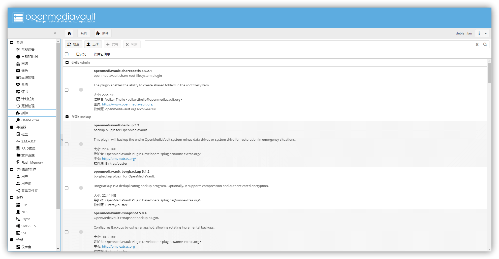
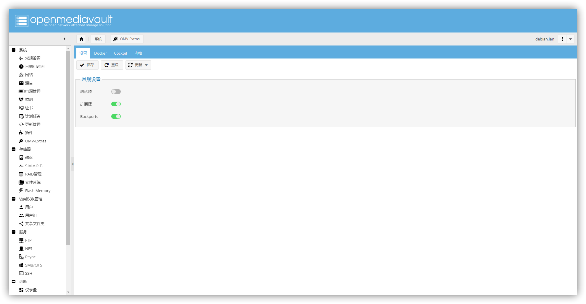

这一篇文章我们讲 OMV 上安装扩展插件。

<!-- more -->

> 本文适用于 OMV5。

接上一篇教程，咱们装完了 OMV 系统，但是刚刚装完的系统，插件会特别少，我们需要安装扩展才可以。

## 视频教程

<Bilibili bvid="BV18v411y74i" :page=1 :danmaku="true" />

## 安装

使用 root 用户登录到 omv。

```bash
ssh root@omv
```

然后安装插件

```bash
wget -O - https://github.com/OpenMediaVault-Plugin-Developers/packages/raw/master/install | bash
```

安装之后就可以发现，插件变多了。





## 参考

[https://omv-extras.org/](https://omv-extras.org/)

---
