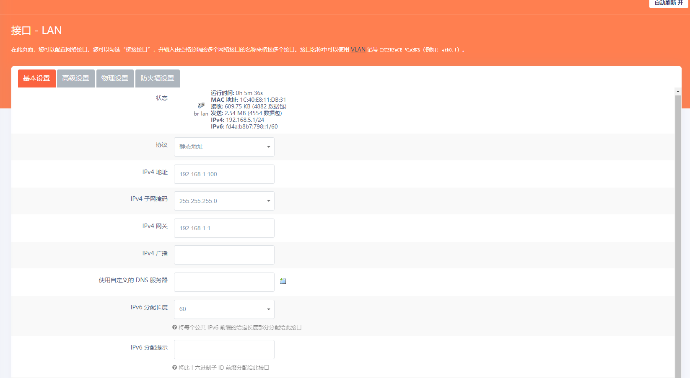

这一篇文章简单讲解怎么把一个 OpenWRT 系统的路由器变成 AP 和交换机使用。

首先修改无线网络的设置

将模式改为 `接入点AP(WDS)`，然后应用并保存即可。

接下来设置 LAN 口，找到 `网络-接口` 先关闭 WAN 口，对，我们不需要使用 WAN 口。

然后修改 LAN 口设置。

- 协议：静态地址
- IPV4 网络：192.168.1.x，建议设置小于 100
- 子网掩码：255.225.255.0
- IPV4 网关：192.168.1.1 （主路由的地址）

注意 AP 的网段要和主路由相同，根据你自己的实际情况修改参数。

然后在这个接口上关闭 DHCP。

再把以前的 WAN 口也添加进来，组成网桥

设置完成后保存并应用，此时会连不上路由器，不要着急，接着往下看。

将路由器的任意一口和主路由的 LAN 口连接，接下来就可以用前面设置的固定 IP 登录到这个 AP 节点了。

因为没有 AC，所以不能统一管理，但是只要所有 AP 节点都支持 802.11 kvr 协议，就可以自动切换 AP。

## 作为任意路由器的 AP

不推荐这么做，但是设置好了真的很方便，方便接入到不同的网络里。

和上面设置类似，只不过 LAN 口协议改为 DHCP 客户端。

---
