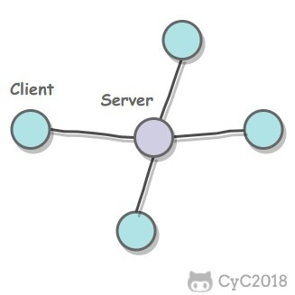
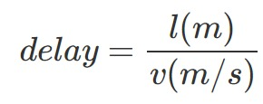

> 本文转载自 [https://www.notes.worstone.cn/2020/09/21/计算机网络-概述/](https://www.notes.worstone.cn/2020/09/21/%E8%AE%A1%E7%AE%97%E6%9C%BA%E7%BD%91%E7%BB%9C-%E6%A6%82%E8%BF%B0/)

## 网络的网络

网络把主机连接起来，而互连网（internet）是把多种不同的网络连接起来，因此互连网是网络的网络。而互联网（Internet）是全球范围的互连网。

## ISP

互联网服务提供商 ISP 可以从互联网管理机构获得许多 IP 地址，同时拥有通信线路以及路由器等联网设备，个人或机构向 ISP 缴纳一定的费用就可以接入互联网。

目前的互联网是一种多层次 ISP 结构，ISP 根据覆盖面积的大小分为第一层 ISP、区域 ISP 和接入 ISP。互联网交换点 IXP 允许两个 ISP 直接相连而不用经过第三个 ISP。

## 主机之间的通信方式

- 客户-服务器（C/S）：客户是服务的请求方，服务器是服务的提供方。

- 对等（P2P）：不区分客户和服务器。

## 电路交换与分组交换

### 电路交换

电路交换用于电话通信系统，两个用户要通信之前需要建立一条专用的物理链路，并且在整个通信过程中始终占用该链路。由于通信的过程中不可能一直在使用传输线路，因此电路交换对线路的利用率很低，往往不到 10%。

### 分组交换

每个分组都有首部和尾部，包含了源地址和目的地址等控制信息，在同一个传输线路上同时传输多个分组互相不会影响，因此在同一条传输线路上允许同时传输多个分组，也就是说分组交换不需要占用传输线路。

在一个邮局通信系统中，邮局收到一份邮件之后，先存储下来，然后把相同目的地的邮件一起转发到下一个目的地，这个过程就是存储转发过程，分组交换也使用了存储转发过程。

## 时延

总时延 = 排队时延 + 处理时延 + 传输时延 + 传播时延

### 排队时延

分组在路由器的输入队列和输出队列中排队等待的时间，取决于网络当前的通信量。

### 处理时延

主机或路由器收到分组时进行处理所需要的时间，例如分析首部、从分组中提取数据、进行差错检验或查找适当的路由等。

### 传输时延

主机或路由器传输数据帧所需要的时间。

其中 l 表示数据帧的长度，v 表示传输速率。

### 传播时延

电磁波在信道中传播所需要花费的时间，电磁波传播的速度接近光速。

其中 l 表示信道长度，v 表示电磁波在信道上的传播速度。

## 计算机网络体系结构

### 五层协议

- **应用层** ：为特定应用程序提供数据传输服务，例如 HTTP、DNS 等协议。数据单位为报文。
- **传输层** ：为进程提供通用数据传输服务。由于应用层协议很多，定义通用的传输层协议就可以支持不断增多的应用层协议。运输层包括两种协议：传输控制协议 TCP，提供面向连接、可靠的数据传输服务，数据单位为报文段；用户数据报协议 UDP，提供无连接、尽最大努力的数据传输服务，数据单位为用户数据报。TCP 主要提供完整性服务，UDP 主要提供及时性服务。
- **网络层** ：为主机提供数据传输服务。而传输层协议是为主机中的进程提供数据传输服务。网络层把传输层传递下来的报文段或者用户数据报封装成分组。
- **数据链路层** ：网络层针对的还是主机之间的数据传输服务，而主机之间可以有很多链路，链路层协议就是为同一链路的主机提供数据传输服务。数据链路层把网络层传下来的分组封装成帧。
- **物理层** ：考虑的是怎样在传输媒体上传输数据比特流，而不是指具体的传输媒体。物理层的作用是尽可能屏蔽传输媒体和通信手段的差异，使数据链路层感觉不到这些差异。

### OSI

其中表示层和会话层用途如下：

- **表示层** ：数据压缩、加密以及数据描述，这使得应用程序不必关心在各台主机中数据内部格式不同的问题。
- **会话层** ：建立及管理会话。

五层协议没有表示层和会话层，而是将这些功能留给应用程序开发者处理。

### TCP/IP

它只有四层，相当于五层协议中数据链路层和物理层合并为网络接口层。

TCP/IP 体系结构不严格遵循 OSI 分层概念，应用层可能会直接使用 IP 层或者网络接口层。

### 数据在各层之间的传递过程

在向下的过程中，需要添加下层协议所需要的首部或者尾部，而在向上的过程中不断拆开首部和尾部。

路由器只有下面三层协议，因为路由器位于网络核心中，不需要为进程或者应用程序提供服务，因此也就不需要传输层和应用层。

## 参考链接

- 计算机网络, 谢希仁
- JamesF.Kurose, KeithW.Ross, 库罗斯, 等. 计算机网络: 自顶向下方法 [M]. 机械工业出版社, 2014.
- W.RichardStevens. TCP/IP 详解. 卷 1, 协议 [M]. 机械工业出版社, 2006.
- [Active vs Passive FTP Mode: Which One is More Secure?](https://securitywing.com/active-vs-passive-ftp-mode/)
- [Active and Passive FTP Transfers Defined - KB Article #1138](http://www.serv-u.com/kb/1138/active-and-passive-ftp-transfers-defined)
- [Traceroute](https://zh.wikipedia.org/wiki/Traceroute)
- [ping](https://zh.wikipedia.org/wiki/Ping)
- [How DHCP works and DHCP Interview Questions and Answers](http://webcache.googleusercontent.com/search?q=cache:http://anandgiria.blogspot.com/2013/09/windows-dhcp-interview-questions-and.html)
- [What is process of DORA in DHCP?](https://www.quora.com/What-is-process-of-DORA-in-DHCP)
- [What is DHCP Server ?](https://tecadmin.net/what-is-dhcp-server/)
- [Tackling emissions targets in Tokyo](http://www.climatechangenews.com/2011/html/university-tokyo.html)
- [What does my ISP know when I use Tor?](http://www.climatechangenews.com/2011/html/university-tokyo.html)
- [Technology-Computer Networking[1]-Computer Networks and the Internet](http://www.linyibin.cn/2017/02/12/technology-ComputerNetworking-Internet/)
- [P2P 网络概述.](http://slidesplayer.com/slide/11616167/)
- [Circuit Switching (a) Circuit switching. (b) Packet switching.](http://slideplayer.com/slide/5115386/)

---
