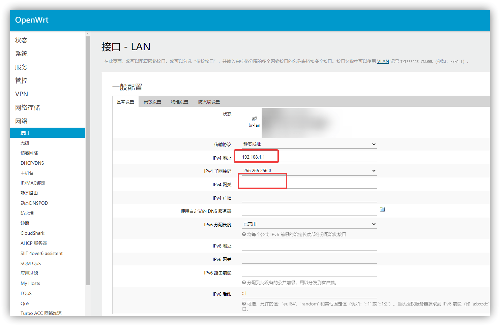

::: warning
本文只适用于 OpenWRT 系统
:::

## 找不到后台登陆地址？

### 能连接显示器和键盘

如果能连接显示器和键盘，就登录输入命令

```
ifconfig br-lan
```

输出的 ip 就是登录地址。

### 不能连接显示器

不能连接显示器，就断开软路由和其他设备的连接，只留一个电脑插 LAN 口，然后电脑网络设置为 DHCP 模式。


等一会或者重新拔插网线，看详细信息


网关就是管理后台的地址。

## 怎么修改管理地址？

### 可以在浏览器登录

如果能登陆到后台，就直接修改，在网络-接口-LAN 口选项卡中。



### 不能在浏览器登录

如果因为特殊原因不能正常登录到后台，如果可以接显示器和键盘，可以临时修改 LAN 口地址，然后再登录到后台。

连接显示器和键盘，登录，输入命令

```
ifconfig br-lan 192.168.1.1
```

然后连接电脑，打开浏览器，使用 ip `192.168.1.1` 登录到后台，按照上面的步骤修改。

### 不想开浏览器

连接显示器或者 ssh 连接到后台

```
## 查看当前 IP
ifconfig br-lan

## 修改 IP，注意要修改为你自己的，其中 192.168.1.1 为原本的 ip，192.168.1.101 为想要设置的 ip
sed -i "s/option ipaddr '192.168.1.1'/option ipaddr '192.168.1.101'/g" /etc/config/network

## 重启网卡
service network restart
```

---
