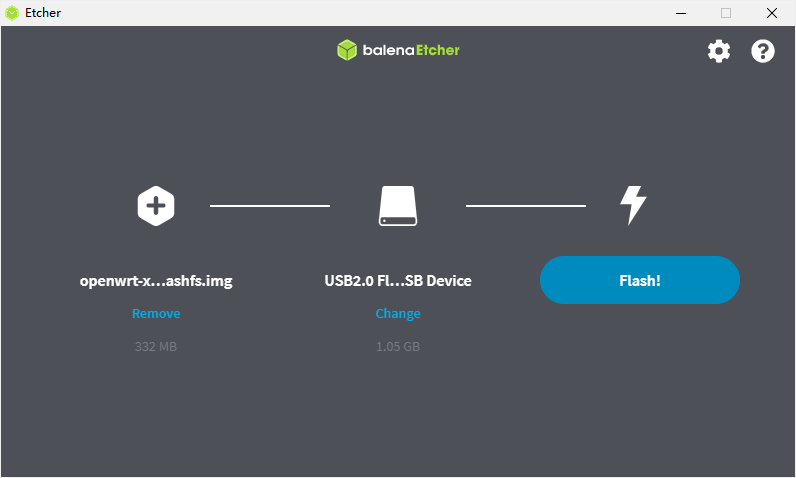
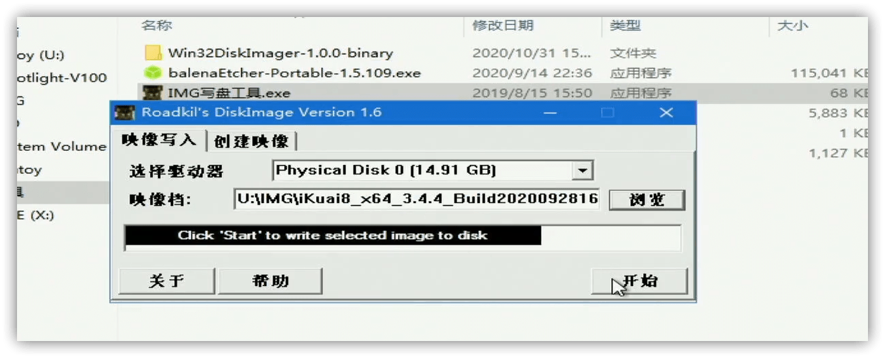

## 直接向 U 盘、硬盘烧录

### 准备软件

推荐使用的软件是：

1. [etcher](https://etcher.io/)
2. [rufus](https://rufus.ie/)

只要使用其中一个就可以了，我个人比较推荐使用 etcher，下面我以 etcher 为例，简单说明一下怎么烧录镜像。

### 下载镜像

首先需要下载一个合适的镜像，openwrt 的话可以在 GitHub 上找，也可以在恩山去找别人编译的，也可以自己动手编译一个，不想找的话可以用我自己编译的镜像，或者是 HomeLede 镜像。

- [我编译的镜像](https://dl.u2sb.com/#/s/GPIQ?path=%2Fblog%2F%E8%BD%AF%E8%B7%AF%E7%94%B1%2FOpenWRT)
- [HomeLede](https://github.com/xiaoqingfengATGH/HomeLede)

里面每个镜像都不一样，直接往 U 盘里烧，选择 img 格式的即可。

爱快直接到[官网](https://www.ikuai8.com/component/download)下载即可

### 烧录镜像

插上 U 盘，然后打开软件。

拖入待烧录的文件，选择 U 盘设备，然后点击 Flash 即可。

等进度条走完了，弹出 U 盘，拔掉就可以了。

## 使用 PE 烧录镜像

### 准备软件

需要软件 DiskImage，自行百度，随便下载一个就可以。

### 制作 PE

自行百度。

### 下载镜像

同上，记住要把下载好的镜像拷进 U 盘里。

### 烧录镜像

插入 U 盘进电脑，修改启动项，进入 PE，打开烧录软件，选择合适的硬盘，选择镜像，点击 `开始` ，即可烧录。

## 其他工具

多一种方法多一条路，其他方法可以参考 [软路由烧录镜像](./../../02.软路由/0005.从入门到入土/0040.烧录镜像.md)
