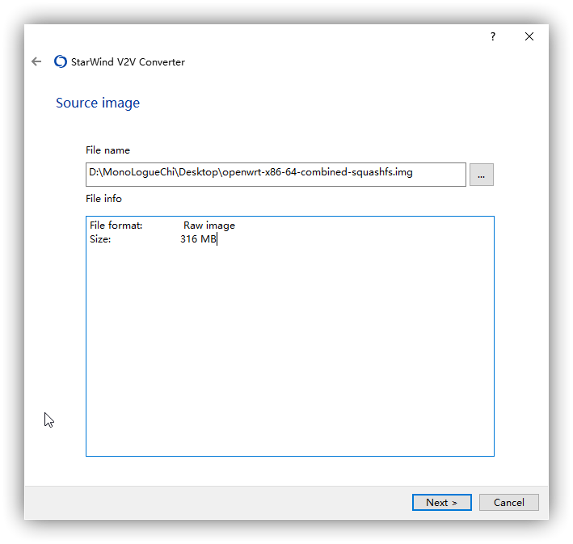

使用虚拟机安装软路由可能会遇到一个问题，我们想要安装的系统，没有编译想要的镜像格式，这个时候就只能自己手动转换了。

下载[镜像转换工具](https://dl.u2sb.com/#/2/main/%E5%AE%9E%E7%94%A8%E5%B7%A5%E5%85%B7/%E7%A1%AC%E7%9B%98%E5%92%8C%E9%95%9C%E5%83%8F%E5%A4%84%E7%90%86/StarWindV2VConverter)，然后打开软件。

选择 `Local file`，然后选择自己需要转换的镜像，我这里以一个 `.img` 格式的镜像转换为 `.vhdx` 格式为例。

输出还是选择 `Local file`。

然后选择需要转换的格式。

最后选择输出路径。

即可完成转换。

## 常见虚拟机支持的镜像格式

| 虚拟机                             | 支持的镜像                                     |
| ---------------------------------- | ---------------------------------------------- |
| `Hyper-V`                          | `VHDX` `VHD` [^hyper-v支持磁盘格式]            |
| `VMware Workstation` `VMware ESXI` | `VMDK`                                         |
| `PVE`                              | `QCOW2` `RAW` 等 [^pve支持磁盘格式]            |
| `QEMU-KVM`                         | `QCOW2` `RAW` `IMG` 等 [^qemu-kvm支持磁盘格式] |
| `VirtualBox`                       | `VDI` `VMDK` `VHD` `HDD` [^vbox支持磁盘格式]   |

[^hyper-v支持磁盘格式]: [虚拟硬盘](https://docs.microsoft.com/zh-cn/windows-server/administration/performance-tuning/role/hyper-v-server/storage-io-performance#virtual-hard-disks)
[^pve支持磁盘格式]: [Proxmox VE Administration Guide](https://pve.proxmox.com/pve-docs/pve-admin-guide.html)
[^qemu-kvm支持磁盘格式]: [Disk Images](https://www.qemu.org/docs/master/system/images.html)
[^vbox支持磁盘格式]: [Chapter 5. Virtual Storage](https://www.virtualbox.org/manual/ch05.html#vdidetails)

---
