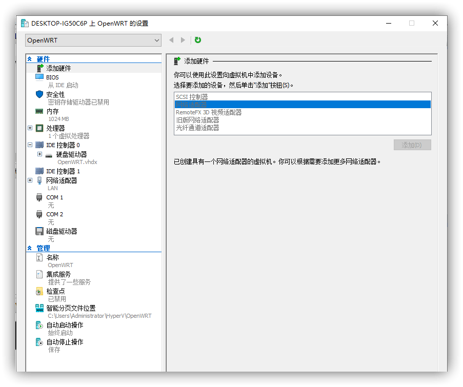

## 单网口设备

单网口设备可以使用 Hyper-V 虚拟机安装软路由，充当旁路由使用。

### 准备镜像

Hyper-V 虚拟机需要 `.vhdx` 格式的镜像，如果你下载的镜像不是 vhdx，或者没有编译这种格式的镜像，就需要转换一个。

如果您下载的不是 vhdx 格式的镜像，就需要按照[镜像转换](./0010.镜像格式转换.md)的方法，转换为 vhdx 格式。

### 安装过程

Hyper-V 虚拟机的使用不多说了，默认从已经开启 Hyper-V 虚拟机开始说。

首先创建一个虚拟交换机，选择外部网络，如果你身边没有其他电脑可以使用的话，这一步可以先创建一个内部网络，这样就可以在这台电脑上登录到软路由后台了，后面其他的步骤一致。

因为 Hyper-V 虚拟机，必须要插网线外部虚拟交换机才会正常启用。

然后新建虚拟机，此时要注意一下，如果你使用的是 UEFI 启动的镜像要选择二代，非 UEFI 启动的镜像要选择一代。我演示用的镜像是非 UEFI 的，所以我选择一代。

使用 UEFI 镜像的时候一定要注意，要在设置里把安全启动给关了，否则是不能开机的。

其他和正常使用 Hyper-V 虚拟机一样，只有一点需要注意，就是磁盘这里要选择`使用现有虚拟磁盘`，这个就是提前准备好的软路由镜像。

创建完成虚拟机之后，可以对虚拟机的配置做一些调整，然后开机。

### 设置

找另一台电脑，插上网线，进入软路由后台，然后按照[旁路由](./../../02.软路由/0030.特殊用法/0010.旁路由.md)的方法设置。设置完成后，拔掉电脑，接入主路由，测试旁路由是否正常。

对于网络里的所有机器来说（包括安装虚拟机的物理机），是感知不到虚拟机的存在的，直接把它当成一台软路由就可以，别去纠结虚拟机里装软路由怎么使用，和物理机是完全一样的，对外没有区别。

## 双网口设备

多网口设备和双网口设备基本一致，看懂双网口设备，多网口的自然就懂了。

### 虚拟交换机

首先创建虚拟交换机，LAN 口设置和单网卡设备一致，WAN 口则设置为虚拟机独占，就是不要共享给物理机。

### 安装虚拟机

安装虚拟机过程和单网卡设备基本一致，安装的时候先选择 LAN 口。

### 设置

安装完成之后直接开机，然后用另一台电脑，插入 LAN 口，登录到后台，确定一下没有问题，然后再添加 WAN 口。

先关机，然后添加网络适配器，就选择前面创建了 WAN 口。

然后重新将软路由开机，进入后台，WAN 口插入网线，拨号或者设置其他上网方式。

如果还需要安装其他的虚拟机，网络连接全部选择 LAN 口的虚拟交换机。

视频教程：

<Bilibili bvid="BV1Zv41117BF" :page="1" :danmaku="true" />

---
