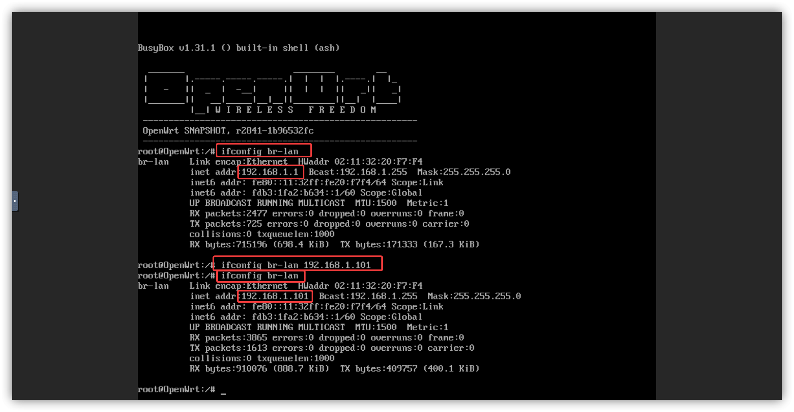

在群晖的虚拟机上安装 OpenWRT 作为旁路由，首先要安装好虚拟机套件，然后进行合适的设置。

## 网络设置


桥接合适的网卡。

## 导入镜像


## 设置虚拟机

导入虚拟机，就是点新增旁边那个小三角，然后选择从硬盘导入


一般使用的话 1 核 1G 足够了，然后选择磁盘，就是前面导入的镜像，并且改为 SATA 模式


网络选择刚才创建的即可，然后根据自己的实际情况选择


再后面的设置就不需要多说了，自己看情况来吧。

## 设置为旁路由

开机，然后连接，参考 [常见问题](./../../02.软路由/0999.常见问题/0010.网络相关.md)

输入命令

```
ifconfig br-lan 192.168.1.101
```



注意，后面的 IP 一定要和你的上一级路由器在同一网段里。

然后浏览器打开 `192.168.1.101` 进入后台，将 LAN 口 IP 改为 192.168.1.101，剩下的参考 [旁路由设置](./../../02.软路由/0030.特殊用法/0010.旁路由.md))

---
