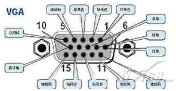
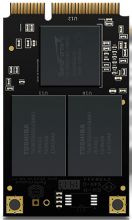
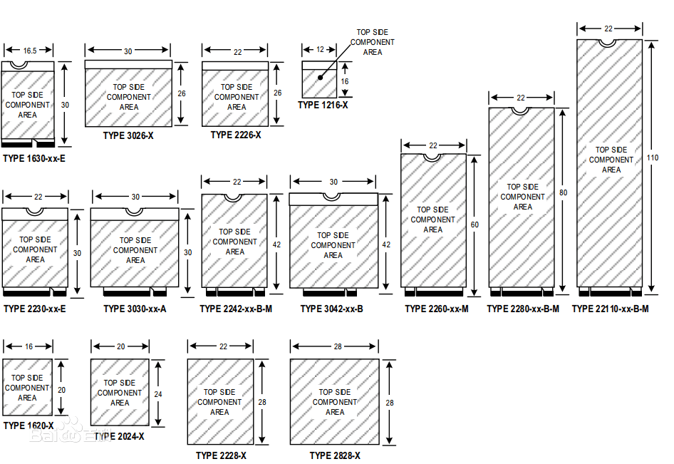
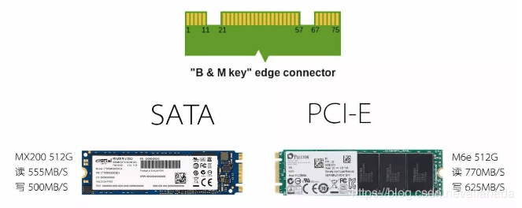

## 说明

这只是一篇简单的面向新手的接口科普文章，老鸟就别看了，你们瞧不上眼的。

在正式开始文章之前，先简单说民一下，一个接口是有形状和协议两部分组成的，形状一样的接口，协议不一定一样（参考 mini-pcie 和 msata 接口）。协议相同，接口形状也不一定相同（参考 sata 和 masta）。

举个简单的例子，一个碗，可以用来装米饭，也可以用来装面条。同样是一份米饭，可以装在碗里，也可以装在盘子里，甚至可以装在塑料袋里，但是比较起来，肯定是装在碗里吃比较方便。

本文只讲现代家用电脑上比较常见的接口，难免会有疏漏，请见谅。

## 视频接口

### VGA

VGA 接口叫 D-Sub ，D-Sub 是接口形状，VGA 是协议，一种模拟信号。如果在一些工控机主板上，可能会看到板载的 VGA 接口，这就是各显神通，各种各样的接口都有，见到什么样的都不要奇怪，都有转接线可以转为 D-Sub。

### HDMI

高清多媒体接口，注意是数字信号，可以同时传输视频和音频信号，具体几点几的版本可以传输多大的带宽，支持几 K 的视频，大家可以去百度，这篇文章只是要告诉大家，哪种接口是用来做什么的。

HDMI 接口不止这一种，有 TypeA， TypeB，TypeC，TypeD 几种不同的接口，其中 TypeA 是最常见的，就是上面的接口，标准 19pin。TypeC 和 TypeD 接口较小（C 比 A 小，D 比 C 小，B 比 A 大），用在相机之类的小型设备上较多，B 不常见，不需要了解。

其中 ACD 三种接口，都是 19pin，可以用转接线相互转化（无需芯片）。

### DP

同样也是数字信号，理论上来说比 HDMI 更先进，但是造价也更高，现在普及率不是特别高（很烦人的是，现在大部分显卡只有一个 HDMI 接口，剩下的都是 DP 或者 DVI，但是低端显示器只有 HDMI 和 VGA 接口）。

DP 接口主要有 DP 和 miniDP 两种，两种接口可以互转，不需要芯片。

### DVI

DVI 接口比较混乱，既可以传输模拟信号，也可以传输数字信号，有多种规格的，只要知道 DVI 接口长啥样就行了，不多讲。

### USB Type C

DisplayPort over USB-Type C

看名字就可以知道，通过 USB-Type C 传输的 DP，通过转接卡，可以将接口转为 DP 或者 HDMI。

C 口不一定支持视频输出，支持视频输出的，要分清是 DisplayPort over USB-Type C 还是 雷电。

### 雷电

单独拿出来说一下，不要和前面的混了，雷电早期接口用的 miniDP，现在用的 USB-Type C，这些都是接口形状，重要的是协议，雷电协议里传输的是 DP 信号。

## 硬盘

### SATA

SATA 接口分为数据和供电两部分，数据接口都一样，是 7pin 接口，供电主要有 15pin 和 9pin 两种，分别叫做 7+9 和 7+15，7+15 在硬盘上常见，7+9 在光驱上比较常见。

供电部分的话，一般 2.5 寸硬盘只需要 5V 供电，3.5 寸硬盘需要 12v 和 5v 两种供电。

### mSATA

这里就开始混乱了，mSATA 接口和 miniPCIE 接口完全一致，但是协议不一样，有很少量的主板，同一接口可以同时支持两种协议，可以通过跳帽切换。

除了 msata 和 miniPCIE，还有一个 SATA Mini PCIE，据淘宝店铺所说，主要用在华硕主板上，协议是 SATA，但是线序和 mSATA 不一样。

mSATA 可以和 SATA 互转，无需芯片，但是供电需要转换。

### m.2

这个真不知道该怎么分类了，m.2 是接口形状，还要看协议。

下面说的只针对硬盘，不针对其他 m.2 接口的设备。

看图就知道有多复杂了，硬盘常用的有 2242 和 2280 两种规格，22110 在服务器上用的多，家用很少，注意这是硬盘尺寸，而不是接口形状。

硬盘协议主要有两种，SATA 和 NVME，其中 SATA 是 SATA 3， NVME 走的 PCIE 通道，这是协议，不是接口形状。

接口形状主要有 3 种，B Key， M Key， B+M Key（两个豁口）。其中 B Key 的硬盘，为 SATA 协议，MKey 的为 PCIEx4 或 PCIEx2 协议，B+M 为 SATA 或 PCIEx2。

### SAS

在家用平台上不常见，硬盘上接口形状与 SATA 相似，只是多了几个针脚，主要注意别和 SATA 硬盘搞混了就行。

## 无线网卡

### PCIE

PCIE 接口接口的无线网卡，大多数都是转成 MiniPCIE 或者 m.2 接口，然后再插一张网卡上去，直接看下面。

### MiniPCIE

接口形状参考上面的 mSATA，协议的话是 PCIEx1+USB（MiniPCIE 里可以使用 USB，PCIE 中没有，所以才能看到 PCIE 的无线网卡，还有一条线，要插在主板的 USB 上，否则就无法使用蓝牙）。

miniPCIE 宽度为 30mm，全高网卡高度为 51mm，半高高度为 27mm。

### m.2

又来到了混乱的 m.2 了，m.2 无线网卡目前主要有两种接口，一种是 A+E Key，另一种是 E Key。尺寸基本上都是 2230 的。

协议的话，主要有 PCIE 和 CNVI 两种，其中 A+E Key 的网卡基本都是 PCIE 协议的，E Key 基本都是 CNVI 协议的。

### USB

USB 外接网卡，基本上不用说了。

---
