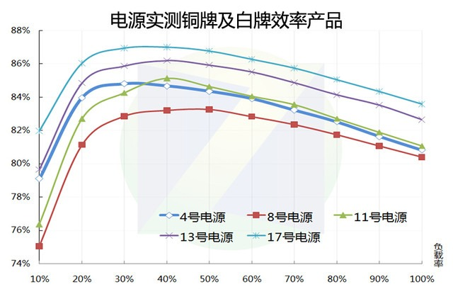

## DC 电源和 ATX 电源该怎么选

DC 电源和 ATX 电源该怎么选？

回答这个问题之前，先科普一下，目前市面上在售的 DC 电源和 ATX 电源，都是开关电源，准确点说，都属于第五代开关电源。

算了，我不装 B 了，直接说结论吧，咱们这一整篇文章都没有考虑 DC-ATX 模块的转化效率问题，如果要算上这个东西的效率，那 DC 电源效率又要打折一次。

具体哪个效率更高，影响因素很多，要看电源的设计，要看电源的堆料，还要看电源的负载情况。

举个简单的例子，假如同是额定 400 瓦的电源，ATX 白金电源打无牌电源，那相同负载下，白金怎么打都是赢。因为 DC 电源只是普通的开关电源，没有铜牌金牌这么多的规定，怎么造全看厂家，并且这些参数不会给你标出来，就是一个 DC 电源不能代表全部的 DC 电源，因为这个东西缺少统一的制造标准，可能有些能达到 ATX 的金牌标准，但更多的只只能相当于无牌 ATX 电源。

除了上面说的，更重要的是额定功率和负载情况，百度搜索 “电源效率曲线”，我找到了中关村在线的一篇文章做参考，原文地址是：https://power.zol.com.cn/630/6308084.html ，感兴趣的朋友可以看一下原文，文中几张图我引用一下，直接上图。

直接看这几张图，大致可以得到结论，ATX 电源负载在 30%-50%的情况下，拥有较高的效率，负载在 20%以下，效率特别低，推到整个开关电源，情况也是大致如此。

有了这个结论，咱们再来看软路由，假设一个软路由待机情况下，负载时 10 瓦左右，注意我说的是主板发负载，也就是电源的输出功率，不是用功率计测得的输入功率。  
如果是一个额定功率为 30 瓦的 DC 电源，此时功耗大概是额定功率的 33%，处在效率曲线比较高的位置。  
如果是一个额定功率为 300 瓦的 ATX 电源，此时功耗大概是额定功率的 3.3%，效率不知道低到哪里去了。

再来看一个功耗比较高的 NAS，假设待机负载为 100 瓦。  
如果是使用一个额定功率为 200 瓦的 DC 电源，这个电源测试结果能达到 ATX 的铜牌标准，那大概就是实际负载在额定功率的 50%左右。  
如果是使用一个额定功率为 300 瓦的金牌 ATX 电源，那大概就是实际负载在额定功率的 33%左右。  
那结果就很明显了，就是金牌打铜牌嘛，直接看上面的图就知道了。
